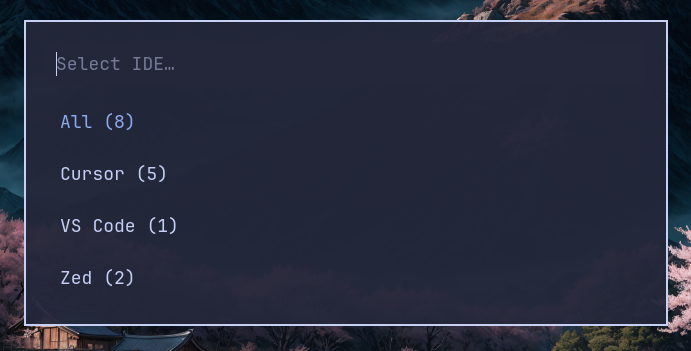
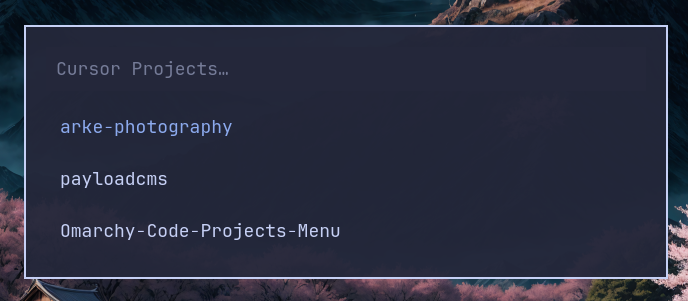

# IDE Projects Menu

A lightweight launcher to quickly open recent IDE projects (Cursor, VS Code, VS Code OSS, VSCodium & Zed) using a dmenu-style menu.

## Features

- Lists all your IDE workspaces sorted by **most recently used**
- Supports multiple editors: **Cursor**, **VS Code**, **VS Code OSS**, **VSCodium**  and **ZED**
- Tabbed interface to filter by IDE
- Shows which editor each project belongs to when viewing all projects
- Fuzzy search through project names
- One-click launch into the appropriate editor

## Screenshots

### IDE Selection Menu


### Project List (Cursor)


## Requirements

- [Node.js](https://nodejs.org/)
- [Walker](https://github.com/abenz1267/walker) (or any dmenu-compatible launcher)
- At least one of: [Cursor](https://cursor.sh/), [VS Code](https://code.visualstudio.com/), [VS Code OSS](https://github.com/microsoft/vscode), or [VSCodium](https://vscodium.com/)

## Installation

```bash
mkdir -p ~/.config/hypr/scripts && \
git clone https://github.com/tomkyriacou64/Omarchy-Code-Projects-Menu.git ~/.config/hypr/scripts/Omarchy-Code-Projects-Menu && \
cd ~/.config/hypr/scripts/Omarchy-Code-Projects-Menu && \
npm i && \
chmod +x ./projects-menu.sh
```

Add binds in your config:

```
# All IDE projects (shows tabbed interface)
bindd = SUPER SHIFT, P, IDE Projects, exec, ~/.config/hypr/scripts/Omarchy-Code-Projects-Menu/projects-menu.sh

# Direct filter by editor
bindd = SUPER SHIFT, C, Cursor Projects, exec, ~/.config/hypr/scripts/Omarchy-Code-Projects-Menu/projects-menu.sh cursor
bindd = SUPER SHIFT, V, VS Code Projects, exec, ~/.config/hypr/scripts/Omarchy-Code-Projects-Menu/projects-menu.sh code
```

## Usage

### Show tabbed interface (select IDE first)
```bash
./projects-menu.sh
```

### Filter by specific editor
```bash
./projects-menu.sh cursor    # Cursor only
./projects-menu.sh code       # VS Code only
./projects-menu.sh codium     # VSCodium only
```

## How It Works

1. `index.js` reads workspace storage from all supported editors
2. Extracts project paths and sorts them by modification time (newest first)
3. `projects-menu.sh` shows a tabbed interface to select IDE, then lists projects
4. Opens the selected project in the appropriate editor (automatically detected)

## Credits

This project is a fork of [Omarchy-Cursor-Projects-Menu](https://github.com/Airbus6804/Omarchy-Cursor-Projects-Menu) by [Airbus6804](https://github.com/Airbus6804), extended to support multiple IDEs.
